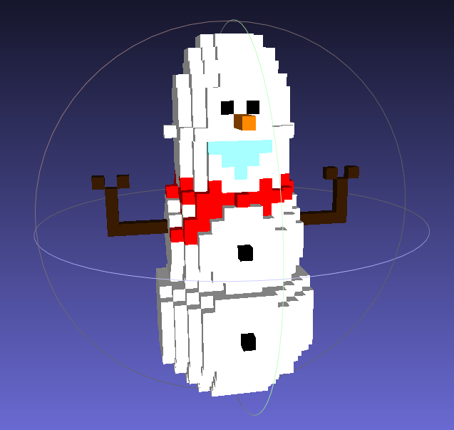

# PROJETO ESCULTURA 3D

## Descrição do Projeto
<p align="center">O projeto trata-se de um simples programa que através de classes gera um arquivo OFF que pode ser lido e exibir uma figura em 3D, nesse projeto estremos mostrando como pode ser feito a escultura em 3D do boneco de neve Olaf
</p>


<p align="center">


</p>
</br>

<h4 align="center"> 
	🚧  Projeto ESCULTURA 3D 🚀 Em construção...  🚧
</h4>
</br>
<p align="center">
 <a href="#-fatures">Fatures</a> •
 <a href="#-pre-requsitos">Pré-requisitos</a> • 
 <a href="#-tecnologias">Tecnologias</a> • 
 <a href="#-contribuicao">Contribuição</a> • 
 <a href="#-autor">Autor</a>
</p>


<hr>
<br>

## 📃 Features

O projeto ainda está em desenvolvimento então abaixo temos o que foi feito até a última atualização:

- [X] Classe Sculptor e struct Voxel
- [X] Alocação Dinâmica
- [X] Gravção de arquivo OFF
- [X] Documentação em doxygen


<h1 align="center">
  
</h1>


<br>

## 💻 Pré-requisitos

Antes de começar, você vai precisar de um editor em C++ e um compilador:
[VSCode](https://code.visualstudio.com/) (use as extensões recomendadas pelo VScode). 
 Além disto é bom usar o git para o versionamento do seu código [Git](https://git-scm.com).

## 🎲 Rodando o projeto

```bash
# Clone este repositório
$ git clone https://github.com/lucasgf007/Web-Scraping

# Abra o seu editor para acessar o código ex.: VScode
$ cd Web-Scraping
$ code .

# Antes de rodar o projeto pela primeira vez, tenha ceteza que 
# MashLab ou outro programa de visualização de aqruivos 3D está instalado e configurado

# Estando tudo ok, execute o projeto e ele irá gerar na mesma do projeto um arquivo olaf.off
# Abrindo arquivo
$ "olaf.off"

# Agora so curtir o nosso bonequinho de gelo 🧊☃️
```
<br>

## 🛠️ Tecnologias

As seguintes ferramentas foram usadas na construção do projeto:

- [C++]()
- [MashLab](https://www.meshlab.net/#download)
- [Doxygen](https://www.doxygen.nl/manual/install.html)
- [VSCode](https://code.visualstudio.com/)
- [Git](https://git-scm.com)

## 📫 Contribuindo para *PROJETO ESCULTURA 3D*

Para contribuir com o projeto, siga estas etapas:

1. Bifurque este repositório.
2. Crie um branch: `git checkout -b <nome_branch>`.
3. Faça suas alterações e confirme-as: `git commit -m '<mensagem_commit>'`
4. Envie para o branch original: `git push origin <nome_do_projeto> / <local>`
5. Crie a solicitação de pull.

Como alternativa, consulte a documentação do GitHub em [como criar uma solicitação pull](https://help.github.com/en/github/collaborating-with-issues-and-pull-requests/creating-a-pull-request).


## 👤 Autor
---
<table>
  <tr>
    <td align="center">
      <a href="https://github.com/lucasgf007">
        <br>
        <sub>
          <a href="https://github.com/lucasgf007" title="Dev"><b>Lucas Gabriel 🚀</b></a>
        </sub>
      </a>
    </td>
    <td align="center">
      <a href="https://github.com/andreluizlimaa">
        <br>
        <sub>
          <a href="https://github.com/andreluizlimaa" title="Dev"><b>André Lima 🚀</b></a>
        </sub>
      </a>
    </td>
  </tr>
</table>


Feito com ❤️ por Lucas Gabriel e Andre Luiz 👋🏽 Entre em contato!

[](mailto:gabriellucas016@gmail.com)
